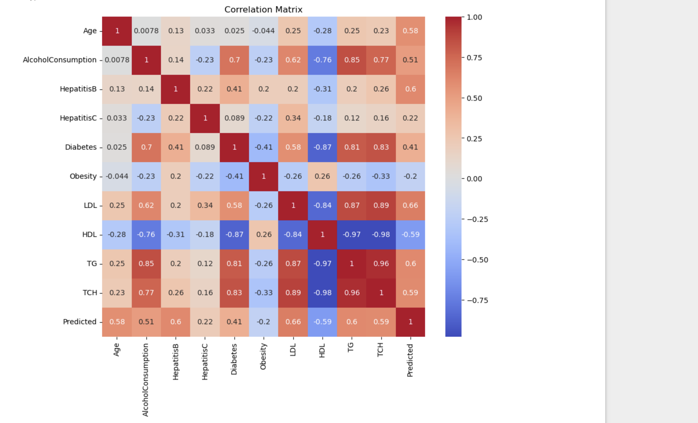

# Liver Cirrhosis Prediction using Machine Learning

This project aims to **predict the presence of liver cirrhosis** based on various medical indicators using machine learning.

---

## 📁 Project Structure

- `liver_data_cleaned.csv` - Cleaned dataset used for analysis
- `liver_cirrhosis_analysis.ipynb` - Jupyter Notebook with EDA and model building
- `head.png`, `describe.png`, `info.png`, `heatmap.png` - Screenshots from EDA

---

## 🔍 Exploratory Data Analysis

- Used `pandas`, `matplotlib`, and `seaborn` to explore the dataset
- Checked for missing values, outliers, and correlations
- Visualized data using heatmaps and summary stats

---

## 🔬 Objective

To analyze patient features and build a machine learning model that predicts whether the patient is likely to suffer from liver cirrhosis.

---

## 🛠️ Tech Stack

- Python (Pandas, NumPy, Matplotlib, Seaborn, Scikit-learn)
- Jupyter Notebook
- Git & GitHub

---

## 👤 Author

**Vasavi Kasina**  
Student, VIT-AP University  
GitHub: [@VasaviK-05](https://github.com/VasaviK-05)

---

## 📸 Screenshots

| Heatmap | Describe | Info |
|--------|----------|------|
|  |  |  |

---

## ✅ Status

✔️ EDA Complete  
🚧 Model building in progress  
📝 Final documentation and video pending
